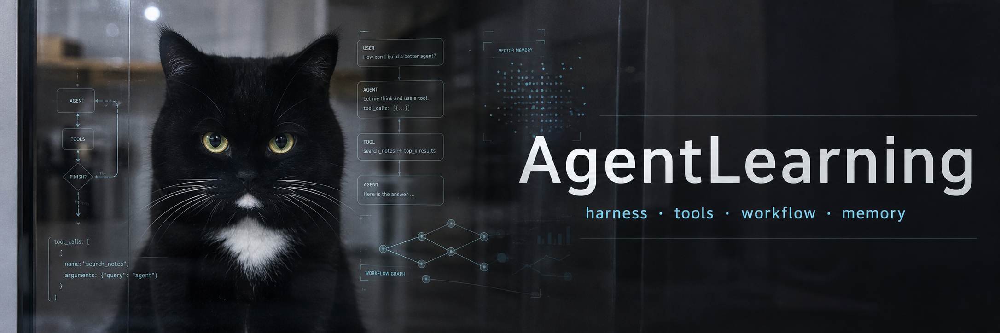

# AgentLearning

Agent harness, tool calling, skill, workflow, and memory learning experiments.

This repository contains small Python examples built around DeepSeek's OpenAI-compatible API. The examples intentionally start simple and gradually add concepts:

- direct model calls
- multi-round `messages`
- JSON output
- tool calling
- agent loops
- multi-tool `finish` flow
- markdown skill loading
- LangGraph workflow
- simple memory injection

## Layout

```text
harness-test/  Python examples for model/tool/harness experiments
notes/         Learning notes and summaries
sjh-style/     Personal style skill draft and references
```

## Setup

Install the Python packages used by the examples:

```powershell
pip install openai langgraph
```

Set your DeepSeek API key before running API examples:

```powershell
$env:DEEPSEEK_API_KEY="your-token"
```

Do not commit `.env` files or API tokens.

## Suggested Next Step

The next practical direction is to build a small CLI learning assistant agent:

```text
User input
  -> LangGraph agent node
  -> notes tools: search_notes / read_note / save_note / finish
  -> simple text memory first
  -> embedding and rerank later
```
